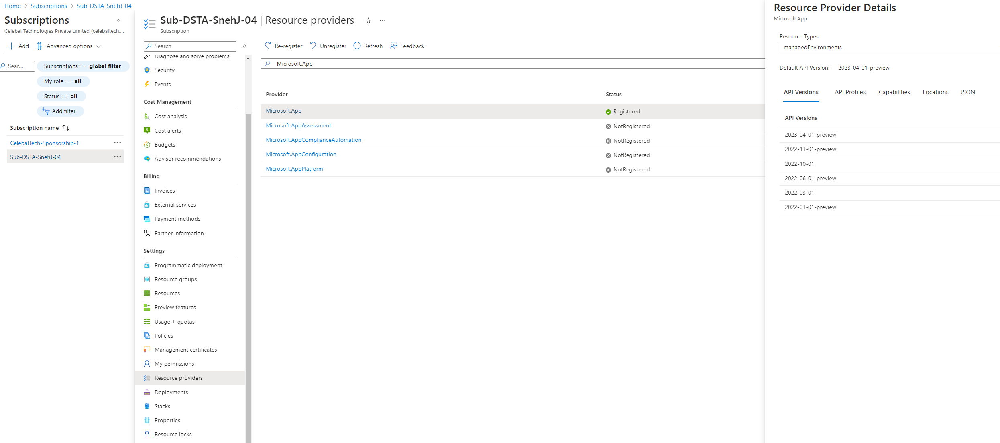
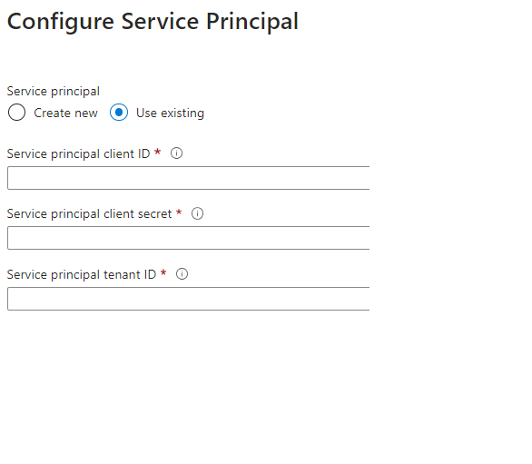
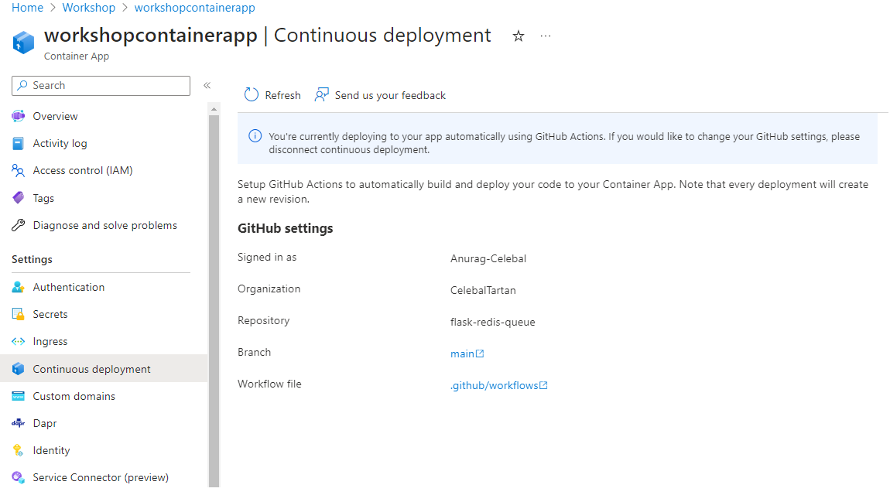
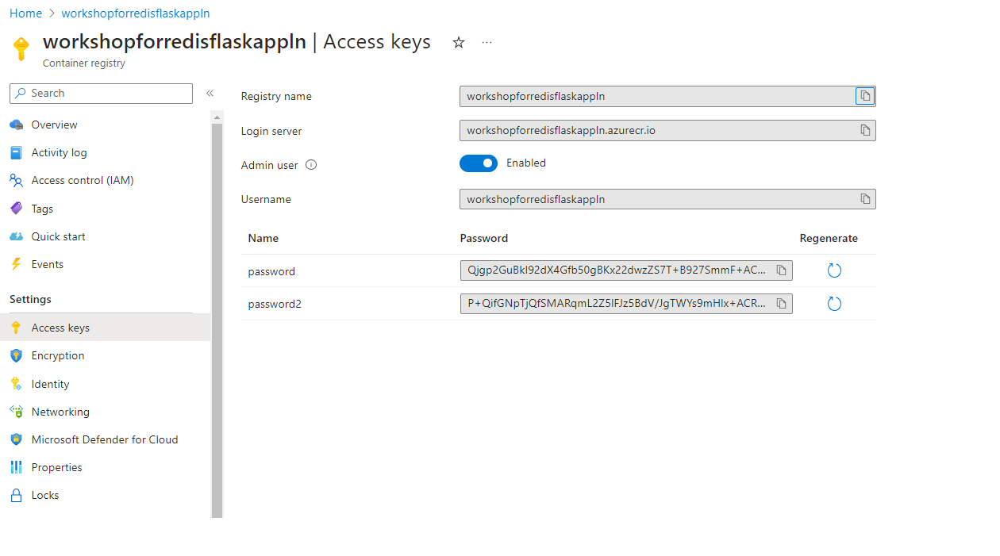

# Flask Redis Queue

Example of how to handle background processes with Flask, Redis Queue, and Docker

## Quick Start

Spin up the containers:

```sh
docker-compose up -d --build --scale worker=3
```

Open dashboard on your browser at http://localhost:9181/

## Azure Container App Deployment

### How to Register Microsoft.App in Azure subscription



# Create Serive Principal 

[howto-create-service-principal-portal](https://learn.microsoft.com/en-gb/azure/active-directory/develop/howto-create-service-principal-portal)

To create a service principal, follow these steps:

1. Log in to the Azure portal (portal.azure.com) using your Azure account credentials.

2. Navigate to the Azure Active Directory (AD) service. You can find it by searching for "Azure Active Directory" in the search bar at the top of the Azure portal.

3. In the Azure AD service, select "App registrations" from the left-hand menu. This section allows you to register applications and services in Azure AD.

4. Click on the "New registration" button to create a new application registration.

5. Provide a name for your service principal in the "Name" field. This name should be meaningful and identifiable for your application or service.

6. Choose the appropriate option for the "Supported account types" based on your requirements. The default option is usually "Accounts in this organizational directory only" but you can select other options as needed.

7. In the "Redirect URI" section, specify the URI where Azure AD should redirect after authentication. This step is optional and depends on your application's requirements.

8. Click on the "Register" button to create the application registration.

9. After the registration is complete, you will be redirected to the overview page for your newly created application. Make note of the "Application (client) ID" value as you will need it to authenticate your application.

10. Now, you need to create a client secret (password) for your service principal. In the left-hand menu, select "Certificates & secrets" under the "Manage" section.

11. Click on the "New client secret" button to create a new secret. Provide a description for the secret and set an expiration period if required.

12. Once you click on "Add", the client secret will be generated, and the value will be displayed. Make sure to copy the secret value as it will not be visible later.

13. Now, you need to assign the necessary permissions to your service principal. __You need to give this permission to both Container Apps and Container Apps Environment.__ To give contributor access to a service principal using Azure Container App role access, follow these steps:

    1. Go to the Azure portal (portal.azure.com) and sign in with your Azure account credentials.

    2. Navigate to the resource group or resource where you want to grant contributor access to the service principal.

    3. In the left-hand menu, click on "Access control (IAM)" to manage role assignments for the selected resource.

    4. Click on the "+ Add" button to add a new role assignment.

    5. In the "Add role assignment" blade, select the role you want to assign. In this case, choose "Contributor" from role definition in Previleged administrator roles.

    6. In the "Add members" section, click on "Select members" to specify the members (users, groups, or service principals) to whom you want to grant the contributor access.

    7. In the "Select members" blade, search for and select the appropriate service principal by selecting "Service principal name" from the drop-down menu and entering the name or part of the name in the search box. Choose the desired service principal from the search results.

    8. Click on the "Select" button to add the selected service principal as a member.

    9. Once you have added the member (service principal), click on the "Review + assign" button to proceed.

    10. Review the details of the role assignment in the "Review + assign" blade to ensure everything is correct.

    11. Finally, click on the "Review + assign" button to complete the role assignment and grant contributor access to the service principal.

    After following these steps, the selected service principal will have been assigned the "Managed Application Contributor Role" with contributor access to the specified resource or resource group.

Remember to securely store the client secret as it acts as the authentication credential for your service principal. Treat it with the same level of security as you would for any other sensitive information.

Please store the following information for future reference:

```sh
Application ID : <service-principal-client-id>

Value : <service-principal-client-secret>

Tenant ID : <servic-principal-tenant-id>

Description: <service-principal-name>
```

After reteriving service principal you need to fill the following information in Service principal settings of Continuous development  



And voila! You have now successfully created a CI/CD pipeline



### How to update .github\workflows\ *.yml files

1. Locate the .yml file that was created inside the .github\workspaces directory.

2. Before deleting the original .yml file, make a note of the secrets that were created:
   - secrets.<CONTAINERAPP_NAME>_REGISTRY_USERNAME
   - secrets.<CONTAINERAPP_NAME>_REGISTRY_PASSWORD
   - secrets.<CONTAINERAPP_NAME>_REGISTRY_AZURE_CREDENTIALS


3. Once you have made a note of the secrets, you can proceed with deleting the original .yml file.

4. Delete the existing .yml file from the .github\workspaces directory.

5. Obtain the cicd.yml file from the desired repository that you want to use.

6. Replace the deleted .yml file with the cicd.yml file in the .github\workspaces directory by making necessary changes in the secrets, Dockerfile name, Azure container app/ DockerHub Login server name and branch name.

7. When logging in to DockerHub instead of Azure Container Registry, replace the registry URL `acr-name.azurecr.io` with `docker.io`. Specifically, replace `workshopforredisflaskappln.azurecr.io` with `docker.io`.

8. For any other updates, please refer [azure-cli commands](https://learn.microsoft.com/en-us/cli/azure/containerapp?view=azure-cli-latest), especially [az-containerapp-update](https://learn.microsoft.com/en-us/cli/azure/containerapp?view=azure-cli-latest#az-containerapp-update).

By following these steps, you will have deleted the existing .yml file and replaced it with the cicd.yml file from the repository. Additionally, you will have taken note of the required secrets for further configuration or reference.

Now, whenever you push changes to the main branch, the cicd.yml file will trigger the continuous integration and continuous deployment (CI/CD) flow.

### How to push docker image to Azure container registry or docker [Optional]

For Azure Container Registry
```sh
docker login <azure_container_registry_name>.azurecr.io
```

Go to Access Keys tab and enable admin user to get username and password




For DockerHub write your username and password after following command 
```sh
docker login
```

After successful login message will be displayed
```sh
Login Succeeded
```
#### Process to Push to your registry

First prefix the image with your registry login URI so that it can be pushed to your private registry.

The first command tags the image for uploading to your registry and the second pushes the image.

```sh
docker tag web:latest <azure_container_registry_name>.azurecr.io/web:latest
docker tag redis:6-alpine <azure_container_registry_name>.azurecr.io/redis:6-alpine
docker tag sad123/dashboard:v1 <azure_container_registry_name>.azurecr.io/sad123/dashboard:v1
```

```sh
docker push <azure_container_registry_name>.azurecr.io/web:latest
docker push <azure_container_registry_name>.azurecr.io/redis:6-alpine
docker push <azure_container_registry_name>.azurecr.io/sad123/dashboard:v1
```